# Annotation-driven Spring Development

1. @Configuration, @Bean, AnnotationConfigApplicationContext
    
        a. bean
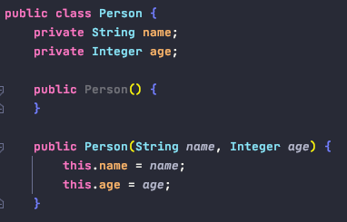
    
        b. config class

        c. annotationConfigApplicationContext

2. @ComponentScan, includeFilters, Filter, FilterType

        a. includeFilters
            - FilterType.ANNOTATION
            - FilterType.ASSIGNABLE_TYPE
            - FilterType.CUSTOM
        b. excludeFilters
    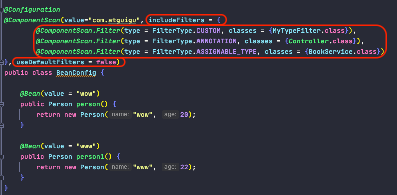

            自定义Filter
    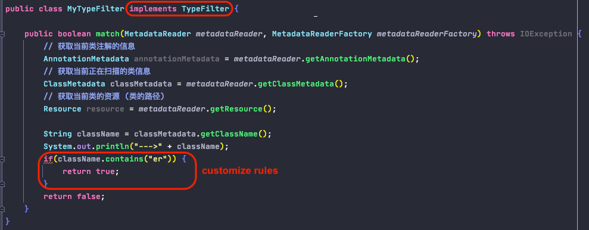
        

3. @Scope, @Lazy

        a. default scope: singleton
        b. singleton: ioc容器启动时就会调动此方法将单实例创建到ioc容器中
        c. prototype: ioc容器启动时并不会去创建对象放到容器中, 而是在每次获取时才创建对象

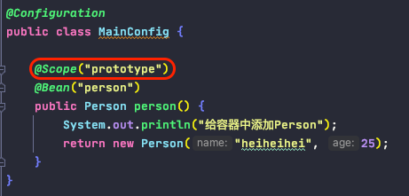

       配置单例bean懒加载: 只有在被调用时才被加载
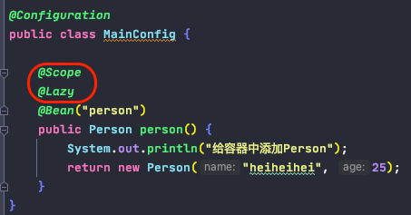

4. @Conditional, customize condition
        
        条件性地向IOC容器中引入bean

        
        customize Condition:
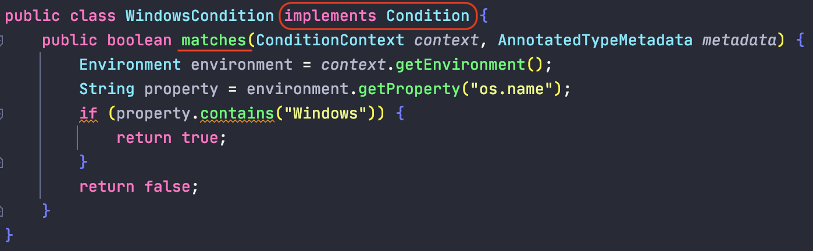

5. @Import
        
        向容器中快速导入一个通过简单无参数构造器创建的bean
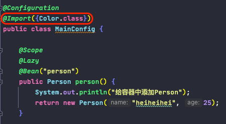
        
       ImportSelector: 导入多个bean (SpringBoot中常用！！！！！！！！！！)
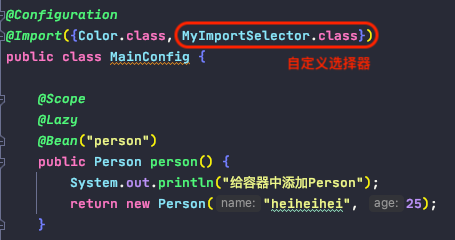
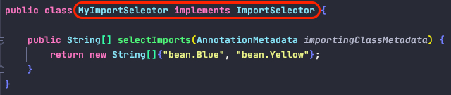

       ImportBeanDefinitionRegistrar: 根据条件手工注册bean
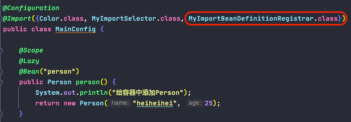
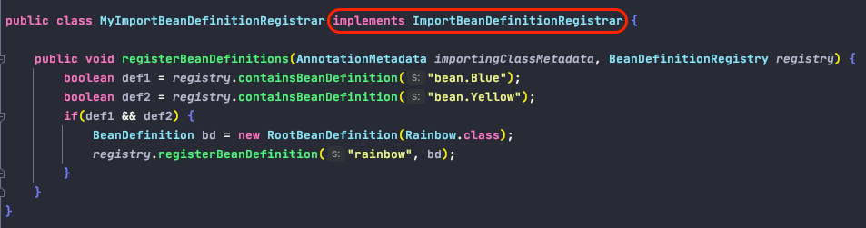
