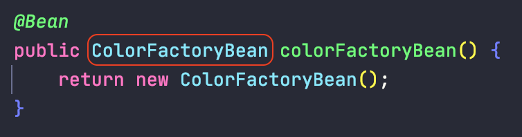
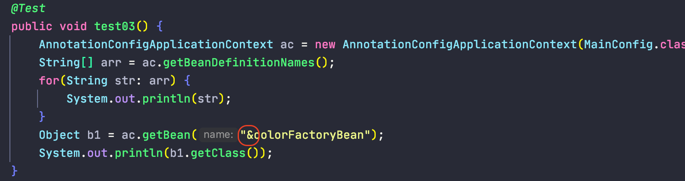
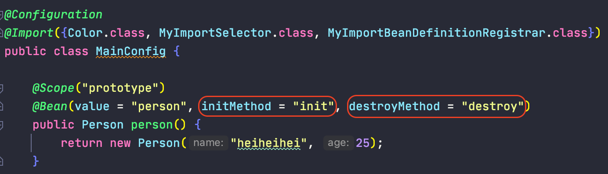
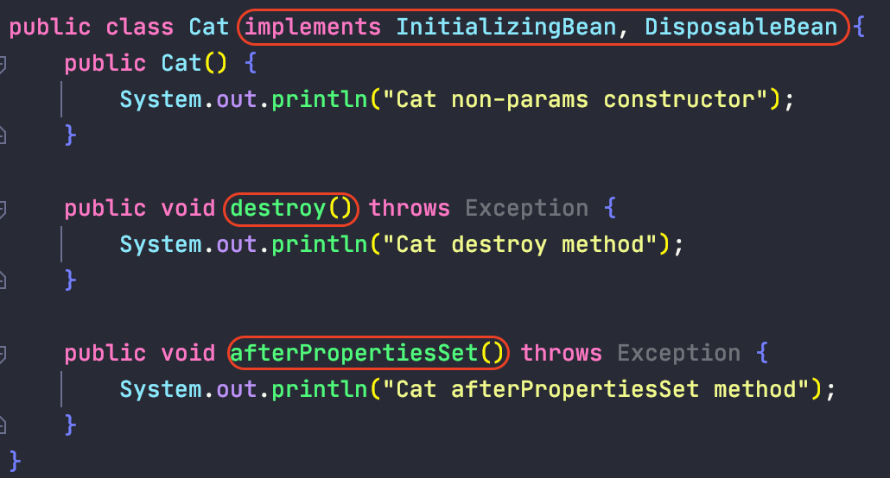
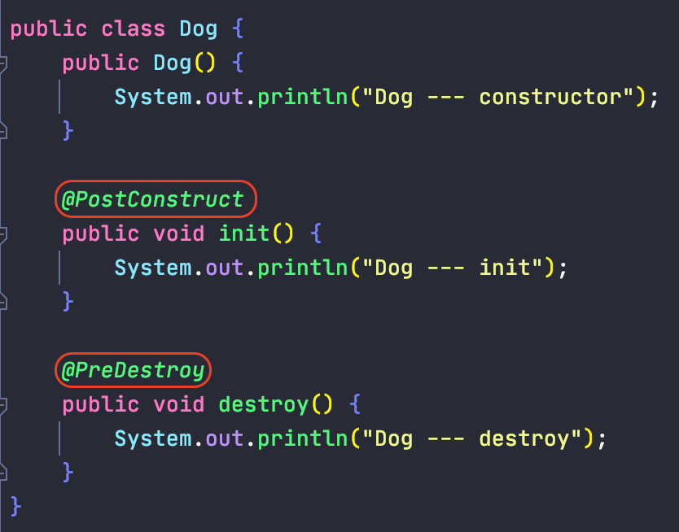
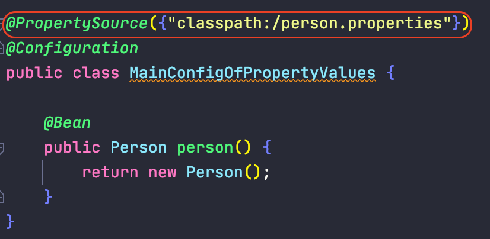
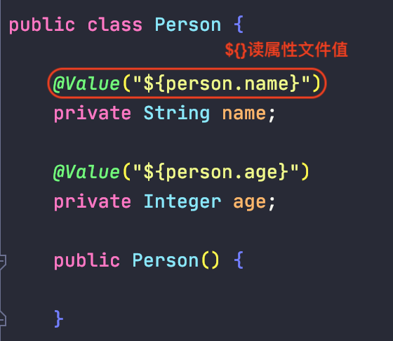

# Annotation-driven Spring Development

1. @Configuration, @Bean, AnnotationConfigApplicationContext
    
        a. bean

    
        b. config class

        c. annotationConfigApplicationContext

2. @ComponentScan, includeFilters, Filter, FilterType

        a. includeFilters
            - FilterType.ANNOTATION
            - FilterType.ASSIGNABLE_TYPE
            - FilterType.CUSTOM
        b. excludeFilters
    

            自定义Filter
    
        

3. @Scope, @Lazy

        a. default scope: singleton
        b. singleton: ioc容器启动时就会调动此方法将单实例创建到ioc容器中
        c. prototype: ioc容器启动时并不会去创建对象放到容器中, 而是在每次获取时才创建对象

       配置单例bean懒加载: 只有在被调用时才被加载

4. @Conditional, customize condition
        
        条件性地向IOC容器中引入bean

        
        customize Condition:

5. @Import
        
        向容器中快速导入一个通过简单无参数构造器创建的bean

        
       ImportSelector: 导入多个bean (SpringBoot中常用！！！！！！！！！！)

       ImportBeanDefinitionRegistrar: 根据条件手工注册bean

6. FactoryBean<T>

        - 容器中的bean是getObject()返回的对象, 虽然在配置文件注册的是FactoryBean
        - 若想获取FactoryBean对象本身, 添加&符号
        - spring与其他框架整合时常用

        定义一个类实现FactoryBean接口

        
       在@Configuration配置文件中注册FactoryBean

       获取FactoryBean本身

7. @Bean Life Cycle Methods

        method_1: @Bean(initMethod, destroyMethod)

       method_2: 实现InitializingBean, DisposableBean接口

    
       method_3: 
            @PostContruct: 在bean创建完成并且属性赋值完成来执行初始化方法
            @PreDestroy: 在容器销毁bean之前执行一些清理工作

       method_4: BeanPostProcessor
            postProcessBeforeInitialization: 在bean初始化之前的后置工作
            postProcessAfterInitialization: 在bean初始化之后的后置工作

8. @Value, @PropertySource
    
        - 基本数值
        - SpEL: #{} spring expression
        - ${}: 取出配置文件中的值, 使用@PropertySource在配置文件中引入属性.properties文件

编辑属性文件

将属性文件引入到配置文件

赋值属性文件中的值

9. @Autowired, @Resource, @Inject
        
        三个注解都支持自动装配:
            - @Autowired: 由Spring定义, 首选
            - @Resource: 由java定义, 默认是按组件名称进行装配;
                         不支持@Primary功能, 以及required=false选项
            - @Inject: 由java定义, 需要导入javax.injext包, 不支持require=false选项
            

10. xxxAware

        - 自定义组件想要注入Spring容器底层的一些组件(ApplicationContext, BeanFactory, xxx);
            自定义组件实现xxxAware接口, 在创建对象的时候, 会调用接口规定的方法注入相关组件

