# Annotation-driven Spring Development

## 容器注入bean

1. @Configuration, @Bean, AnnotationConfigApplicationContext
    
        a. bean

    
        b. config class

        c. annotationConfigApplicationContext

2. @ComponentScan, includeFilters, Filter, FilterType

        a. includeFilters
            - FilterType.ANNOTATION
            - FilterType.ASSIGNABLE_TYPE
            - FilterType.CUSTOM
        b. excludeFilters
    

            自定义Filter
    
        

3. @Scope, @Lazy

        a. default scope: singleton
        b. singleton: ioc容器启动时就会调动此方法将单实例创建到ioc容器中
        c. prototype: ioc容器启动时并不会去创建对象放到容器中, 而是在每次获取时才创建对象

       配置单例bean懒加载: 只有在被调用时才被加载

4. @Conditional, customize condition
        
        条件性地向IOC容器中引入bean

        
        customize Condition:

5. @Import
        
        向容器中快速导入一个通过简单无参数构造器创建的bean

        
       ImportSelector: 导入多个bean (SpringBoot中常用！！！！！！！！！！)

       ImportBeanDefinitionRegistrar: 根据条件手工注册bean

6. FactoryBean<T>

        - 容器中的bean是getObject()返回的对象, 虽然在配置文件注册的是FactoryBean
        - 若想获取FactoryBean对象本身, 添加&符号
        - spring与其他框架整合时常用

        定义一个类实现FactoryBean接口

        
       在@Configuration配置文件中注册FactoryBean

       获取FactoryBean本身

7. @Bean Life Cycle Methods

        method_1: @Bean(initMethod, destroyMethod)

       method_2: 实现InitializingBean, DisposableBean接口

    
       method_3: 
            @PostContruct: 在bean创建完成并且属性赋值完成来执行初始化方法
            @PreDestroy: 在容器销毁bean之前执行一些清理工作

       method_4: BeanPostProcessor
            postProcessBeforeInitialization: 在bean初始化之前的后置工作
            postProcessAfterInitialization: 在bean初始化之后的后置工作

8. @Value, @PropertySource
    
        - 基本数值
        - SpEL: #{} spring expression
        - ${}: 取出配置文件中的值, 使用@PropertySource在配置文件中引入属性.properties文件

编辑属性文件

将属性文件引入到配置文件

赋值属性文件中的值

9. @Autowired, @Resource, @Inject
        
        三个注解都支持自动装配:
            - @Autowired: 由Spring定义, 首选
            - @Resource: 由java定义, 默认是按组件名称进行装配;
                         不支持@Primary功能, 以及required=false选项
            - @Inject: 由java定义, 需要导入javax.injext包, 不支持require=false选项
            

10. xxxAware

        - 自定义组件想要注入Spring容器底层的一些组件(ApplicationContext, BeanFactory, xxx);
            自定义组件实现xxxAware接口, 在创建对象的时候, 会调用接口规定的方法注入相关组件

11. @Profile

        - 根据当前的环境动态地切换一系列组件的功能, eg: dev, test, prod
        
        设置bean的不同环境Profile
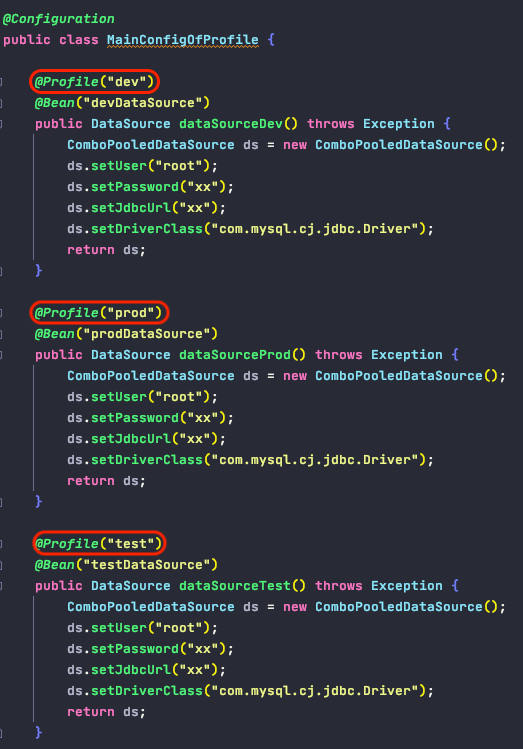
        
      设置环境1: 命令行VM动态参数
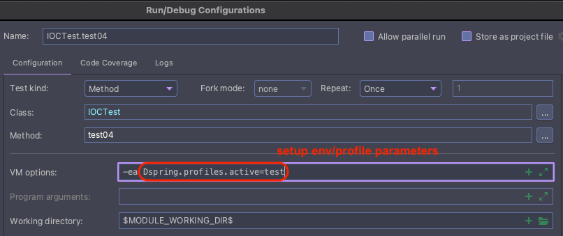
        
      设置环境2: 代码方式, 分步设置容器环境+创建容器
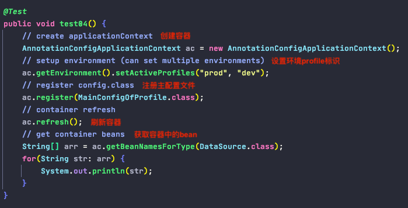

12. Summary of Annotation

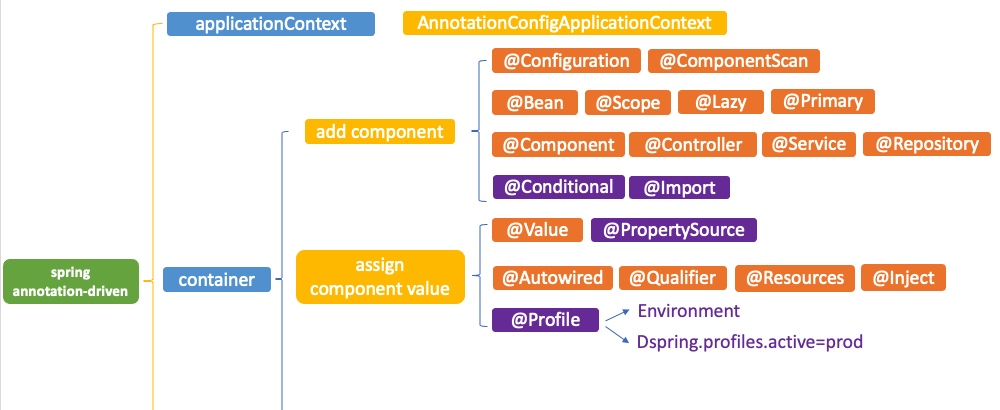

## AOP

1. basic
            
        - @Aspect 指明切面类
        - @Pointcut, @Before, @After, @AfterReturning, @AfterThrowing
        - @EnableAspectJAutoProxy 启动基于注解的aop模式: aspectJ自动代理
        
        目标类
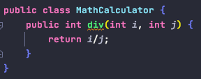
        
        切面类 - 声明切面, 声明切入点表达式
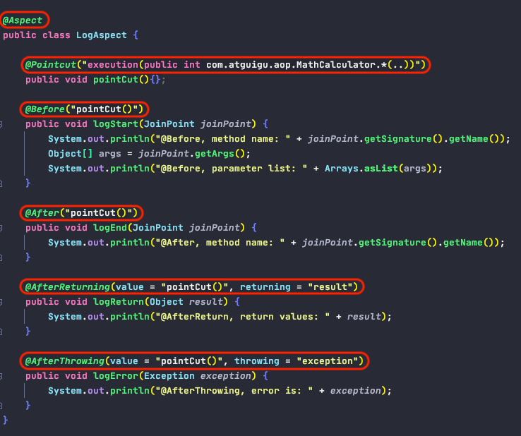        
        
        配置类 - 开启基于注解的aop模式
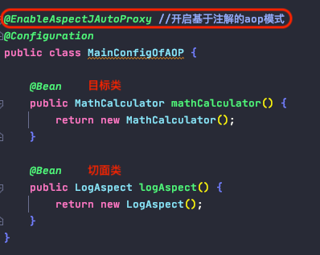   
        
        运行测试类
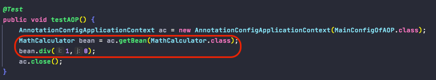   

2. @EnableAspectJAutoProxy 的原理

        a. 向容器中添加AnnotationAwareAspectJAutoProxyCreator组件
        b. AnnotationAwareAspectJAutoProxyCreator组件对bean进行postProcessAfterInitialization操作
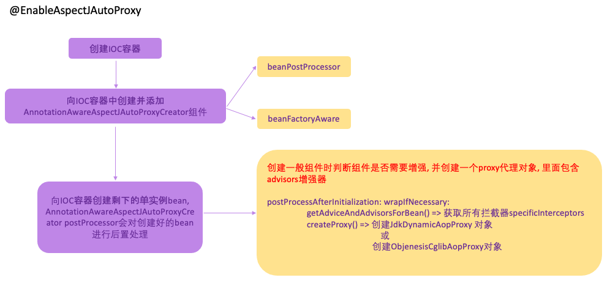
        
        c. 代理对象(proxy)的执行目标方法 -- 拦截器的链式调用:
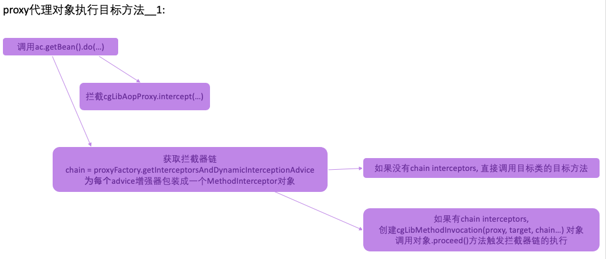
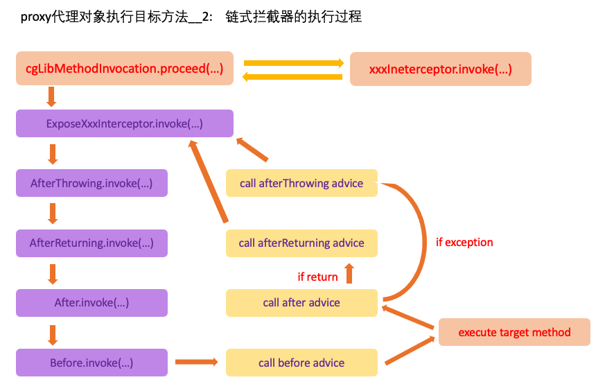

## BeanFactoryPostProcessor -- Interface

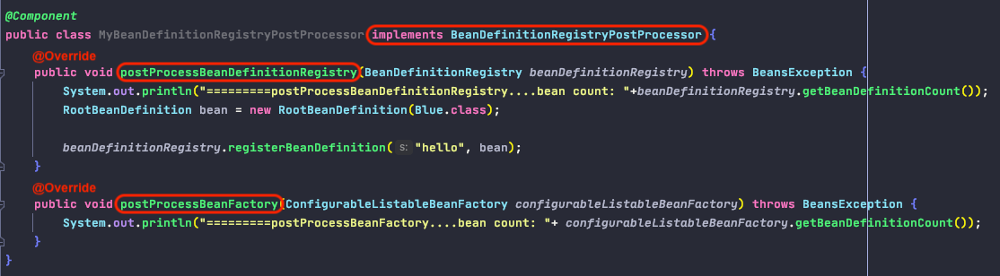

1. 定义
    
        - beanFactory的后置处理器: 在BeanFactory标准初始化之后调用, 来定制和修改BeanFactory的内容, 
            所有的bean定义已经保存加载到beanFactory, 但是bean的实例还未创建
            
2. 原理

        - 在实例化容器时, 调用invokeBeanFactoryPostProcessors(beanFactory), 来注册所有的beanFactoryPostProcessors
        - 在初始化创建其他组件之前执行
        
        
## BeanDefinitionRegistryPostProcessor -- BeanFactoryPostProcessor的子接口

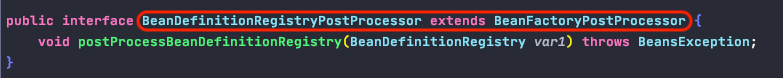
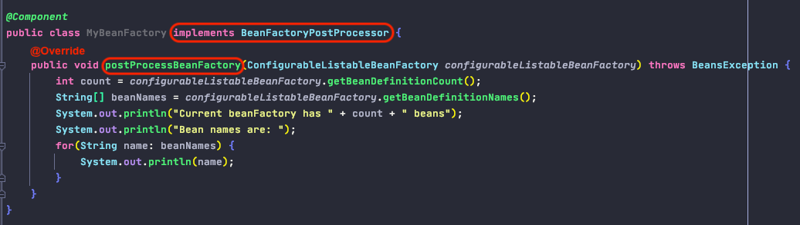

1. 原理

        - postProcessBeanDefinitionRegistry()在所有bean定义信息将要被加载之前, bean实例还未创建时加载
        - 优先于BeanFactoryPostProcessor执行, 利用BeanDefinitionRegistryPostProcessor给容器中再额外添加一些组件
        
2. 执行顺序:

        - 先执行postProcessBeanDefinitionRegistry()方法
        - 再执行postProcessBeanFactory()方法

## ApplicationListener<ApplicationEvent>

1. event-driven development:

        a.监听一个事件:
            1).实现ApplicationListener<ApplicationEvent>接口
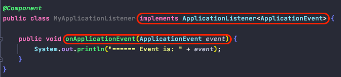

                - 写一个监听器来监听某个事件(ApplicationEvent及其子事件)
                - 把监听器加入到容器中
                - 只要容器中有相关的时间发布, 就可以监听到这个事件, 调用这个监听器的回调 onApplicationEvent()
                
            2).@EventListener 注解在普通组件上
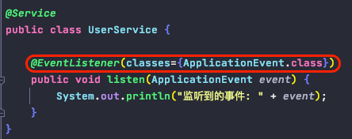

        b. 手动发布一个事件:
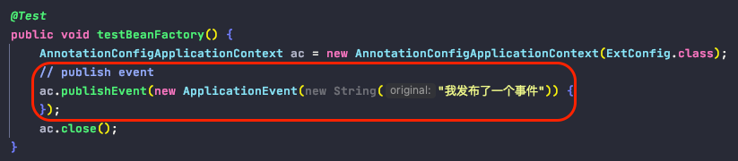
        

2. 事件监听原理: 

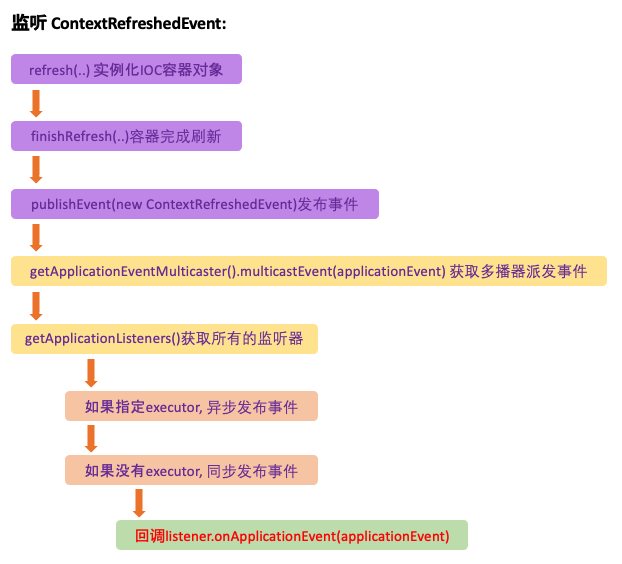

## IOC容器创建过程

refresh():

        1. beanFactory标准初始化
            a. prepareRefresh 创建beanFactory前的预处理
                - initPropertySource() 初始化属性, 覆写子容器自定义属性设置方法
                - getEnvironment().validateRequiredProperties() 校验环境属性值的合法性
                - earlyApplicationListeners/ applicationListeners 设置早期事件监听器
                - earlyApplicationEvents 设置早期事件
                
            b. obtainFreshBeanFactory 获取新鲜的beanFactory实例
                - refreshBeanFactory() 创建beanFactory实例
                    a. 创建一个DefaultListableBeanFactory实例
                    b. beanFactory.setSerializationId() 给工厂设置序列化id
                - getBeanFactory() 返回所创建的beanFactory实例
            
            c. prepareBeanFactory(beanFactor) 创建beanFactory之后的准备工作
                - 设置beanFactory的类加载器, 表达式解析器等等..
                - 添加beanPostProcessors后置处理器
                - 设置忽略的自动装配接口
                - 注册可解析的组件: beanFactory, resourceLoader, applicationEventPublisher, applicationContext
                - 添加编译时的AspectJ xxxWeaver
                - 注册环境/系统变量组件
            
            d. postProcessBeanFactory(beanFactory) beanFactory的后置处理工作
                - 默认为空, 自定义子类可重写这个方法在beanFactory做进一步的设置
