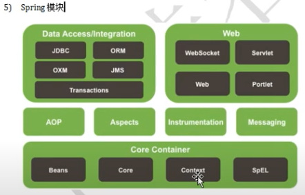

# Spring 

1. Background

    before: servlet + jsp
    struts1 encapsulate s ervlet (20 - 30 years ago) -> reduce code  [deprecated]
    struts2 encapsulate filter (10 years ago)                               [deprecated]

    MVC framework:

        - struts1 (apache)
        - struts2 (apache)
        - springMVC
        
    Persistent framework:
        
        - Hibernate (jboss)
        - Mybatis (apache)

    Integrated/design framework: 

        - spring (以后什么都不用但spring一定会用)

2. Spring 特性 

    - 核心: IoC 和 AOP
    - 特性：
            
            a. 非侵入性 (轻量级) : 
                基于spring开发的应用不依赖于spring的api， 对原来的技术不造成影响

            b. DI:
                反转控制(IOC)最经典的实现
                IOC  是一种思想，DI 是 IOC的一种实现
            
            c. AOP: 对OOP进行补充
            
            d. Spring 是一个容器，因为它包含并且管理应用对象的声明周期
            
            e. 组件化: 实现了使用简单的组件配置组合成一个复杂的应用。组件就是spring管理的对象。以前不是的，解耦了
            
            f. 一站式: 可以整合各种企业应用的开源框架，优秀的第三方类库

3. Spring 模块

    - 最底层最核心: IOC  （beans/ core/ context)

4. IOC (Inversion of Control) & DI (Dependency Injection)

IOC: 
    
    - 传统开发方式:
        组件主动地从容器中获取所需要的资源，因此开发人员需要知道在具体容器中特定资源的获取方式，增加了学习成本，同时降低了开发效率
    - 控制反转: 
        改变了资源的获取方向 -- 改由容器主动地将资源推送给需要的组件，开发人员buxuyao9知道容器是如何创建资源对象的，只需要提供接收资源的方式即可，极大地降低了学习成本，提高了开发效率
    

DI: 

    - 具体的依赖注入的方式, eg: setter()
    
    
    
5. Spring 从容器中获取bean的方式

    1) use bean id

        Object student = (Student) contxt.getBean("bean_id");
        
    2) use class, but must have only one bean configured for this class
    
        Student student = context.getBean( Student.class );
        
    3) use bean id and class -- recommend !!!!
    
        Student student = context.getBean("student1", Student.class);
        

6. ApplicationContext 的主要实现类

    - ClassPathXmlApplicationContext: 对应classpath 下的xml格式的配置文件，使用的是相对路径
    - FileSystemXmlApplicationContext: 对应文件系统中的xml格式的配置文件，使用的是绝对路径
    
    

