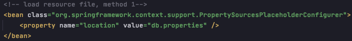

# Spring 2

1. bean Scope (作用域)

        - singleton类型的bean, 在初始化容器时就创建此对象
        - prototype类型的bean, 在使用时才会创建对象

2. bean 的声明周期 (5 stages)

        1) 通过构造器或工厂方法创建 bean 实例
        2）为 bean 的属性设置值和对其他 bean 的引用 -- only difference from servlet
        3) bean 的初始化方法 init()
        4) bean 实现功能
        5) 在容器关闭时，调用 bean 的销毁方法
        
        

3. 定义和调用 init() 和 destroy() 方法

        - Declare bean's init() & destroy() methods inside bean
 

       - Config bean's init() & destroy() methods inside spring-config.xml

       

4. spring-config.xml 引用外部属性文件

eg: spring来管理Druid DataSource

        1) Load property file
            - property configuration 1

            - property configuration 2
        

        2) Use property file resource to conduct DI 

5. Autowire ( = injection = assignment ) 自动装配

        - 手动装配: 在xml文件中，以 value 或 ref 的方式明确指定属性值
        - 自动装配: 根据某种策略自动为非字面量属性赋值 
            - byName: 通过属性名 和 spring 容器中的 bean id 进行比较，若一致可直接赋值

            - byType: 通过spring容器中bean的类型，为兼容性的属性赋值 
                (兼容性: 通过子类对象为父类属性赋值，或通过实现类的对象为借口赋值; spring 容器管理的类必须都是一般实现类，不能是借口或抽象类)
                (问题1: 在使用 byType 的过程中，要求 spring 容器中只能有一个能为属性赋值的 bean)
                (问题2: 一旦定义策略后，会对所有非字面量属性按此策略赋值)

        
# 使用建议: 都不使用！！！！！
        

6. 基于@注释的组件扫描
    
        1) 在spring-config.xml 中配置<context:component-scan base-package="com.xxx.xxx" /> 
        2) @Component, @Controller, @Service, @Repository (默认使用 byType 进行自动装配)
        3) @Autowired @Qualifier(value="bean_id") 添加在field上进行特定dependency的自动装配

